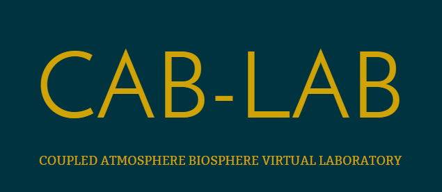

*Yet Another XArray-like Julia Package*

| **Documentation**                                                               | **Build Status**                                                                                |
|:-------------------------------------------------------------------------------:|:-----------------------------------------------------------------------------------------------:|
| [![][docs-dev-img]][docs-dev-url] | [![][ci-img]][ci-url] [![][codecov-img]][codecov-url] |
|  |  [![][coveralls-img]][coveralls-url] |


[docs-dev-img]: https://img.shields.io/badge/docs-dev-blue.svg
[docs-dev-url]: https://JuliaDataCubes.github.io/YAXArrays.jl/dev/

[codecov-img]: https://codecov.io/gh/JuliaDataCubes/YAXArrays.jl/branch/master/graph/badge.svg
[codecov-url]: https://codecov.io/gh/JuliaDataCubes/YAXArrays.jl

[ci-img]: https://github.com/JuliaDataCubes/YAXArrays.jl/workflows/CI/badge.svg
[ci-url]: https://github.com/JuliaDataCubes/YAXArrays.jl/actions?query=workflow%3ACI

[coveralls-img]: https://coveralls.io/repos/github/JuliaDataCubes/YAXArrays.jl/badge.svg?branch=master
[coveralls-url]: https://coveralls.io/github/JuliaDataCubes/YAXArrays.jl?branch=master

## Installation

Add the YAXArrays package:

```julia
julia>]
pkg> add YAXArrays
```

You may check the installed version with:

```julia
] st YAXArrays
```

Start using the package:

```julia
using YAXArrays
```

## Quick start

Let's assemble a `YAXArray` with 3 `RangeAxis`, i.e. time, x,y and a `CategoricalAxis` with two variables.

```julia
axlist = [
    RangeAxis("time", range(1, 20, length=20)),
    RangeAxis("x", range(1, 10, length=10)),
    RangeAxis("y", range(1, 5, length=15)),
    CategoricalAxis("Variable", ["var1", "var2"])]
```
and the corresponding data.
```julia
data = rand(20, 10, 15, 2)
```

You might also add additional properties via a Dictionary, namely

```julia
props = Dict(
    "time" => "days",
    "x" => "lon",
    "y" => "lat",
    "var1" => "one of your variables",
    "var2" => "your second variable",
)
```

And our first YAXArray is built with:

```julia
ds = YAXArray(axlist, data, props)
```
```
YAXArray with the following dimensions
time                Axis with 20 Elements from 1.0 to 20.0
x                   Axis with 10 Elements from 1.0 to 10.0
y                   Axis with 15 Elements from 1.0 to 5.0
Variable            Axis with 2 elements: var1 var2 
Total size: 46.88 KB
```

## Getting data back from a YAXArray

For axis can be via `.` 

```julia
ds.x.values
```
```
1.0:1.0:10.0
```

and the complete data for one of our variables, i.e. `var1` can be accessed via:

```julia
ds[variable = "var1"].data
```

For more please take a look at the documentation. 
