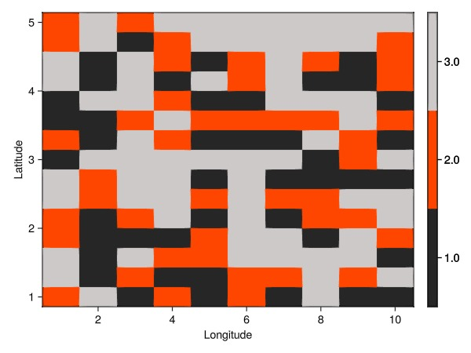

# Frequently Asked Questions (FAQ) {#Frequently-Asked-Questions-FAQ}

The purpose of this section is to do a collection of small  convinient pieces of code on how to do simple things.

## Extract the axes names from a Cube {#Extract-the-axes-names-from-a-Cube}

```julia
using YAXArrays
using DimensionalData
```


```julia
julia> c = YAXArray(rand(10, 10, 5))
```

```ansi
┌ 10×10×5 YAXArray{Float64, 3} ┐
├──────────────────────────────┴───────────────────────────────────────── dims ┐
  ↓ Dim_1 Sampled{Int64} Base.OneTo(10) ForwardOrdered Regular Points,
  → Dim_2 Sampled{Int64} Base.OneTo(10) ForwardOrdered Regular Points,
  ↗ Dim_3 Sampled{Int64} Base.OneTo(5) ForwardOrdered Regular Points
├──────────────────────────────────────────────────────────────────── metadata ┤
  Dict{String, Any}()
├──────────────────────────────────────────────────────────── loaded in memory ┤
  data size: 3.91 KB
└──────────────────────────────────────────────────────────────────────────────┘
```

```julia
julia> caxes(c) # former way of doing it
```

```ansi
(↓ Dim_1 Sampled{Int64} Base.OneTo(10) ForwardOrdered Regular Points,
→ Dim_2 Sampled{Int64} Base.OneTo(10) ForwardOrdered Regular Points,
↗ Dim_3 Sampled{Int64} Base.OneTo(5) ForwardOrdered Regular Points)
```


::: warning

To get the axes of a YAXArray use the `dims` function instead of the `caxes` function

:::

```julia
julia> dims(c)
```

```ansi
(↓ Dim_1 Sampled{Int64} Base.OneTo(10) ForwardOrdered Regular Points,
→ Dim_2 Sampled{Int64} Base.OneTo(10) ForwardOrdered Regular Points,
↗ Dim_3 Sampled{Int64} Base.OneTo(5) ForwardOrdered Regular Points)
```


::: info

Also, use **`DD.rebuild(c, values)`**  to copy axes from `c` and build a new cube but with different values.

:::

### rebuild {#rebuild}

As an example let&#39;s consider the following

```julia
using YAXArrays
using DimensionalData

c = YAXArray(ones(Int, 10,10))
```


```
┌ 10×10 YAXArray{Int64, 2} ┐
├──────────────────────────┴───────────────────────────────────── dims ┐
  ↓ Dim_1 Sampled{Int64} Base.OneTo(10) ForwardOrdered Regular Points,
  → Dim_2 Sampled{Int64} Base.OneTo(10) ForwardOrdered Regular Points
├──────────────────────────────────────────────────────────── metadata ┤
  Dict{String, Any}()
├──────────────────────────────────────────────────── loaded in memory ┤
  data size: 800.0 bytes
└──────────────────────────────────────────────────────────────────────┘
```


then creating a new `c` with the same structure (axes) but different values is done by

```julia
julia> new_c = rebuild(c, rand(10,10))
```

```ansi
┌ 10×10 YAXArray{Float64, 2} ┐
├────────────────────────────┴─────────────────────────────────────────── dims ┐
  ↓ Dim_1 Sampled{Int64} Base.OneTo(10) ForwardOrdered Regular Points,
  → Dim_2 Sampled{Int64} Base.OneTo(10) ForwardOrdered Regular Points
├──────────────────────────────────────────────────────────────────── metadata ┤
  Dict{String, Any}()
├──────────────────────────────────────────────────────────── loaded in memory ┤
  data size: 800.0 bytes
└──────────────────────────────────────────────────────────────────────────────┘
```


note that the type is now `Float64`. Or, we could create a new structure but using the dimensions from `yax` explicitly

```julia
julia> c_c = YAXArray(dims(c), rand(10,10))
```

```ansi
┌ 10×10 YAXArray{Float64, 2} ┐
├────────────────────────────┴─────────────────────────────────────────── dims ┐
  ↓ Dim_1 Sampled{Int64} Base.OneTo(10) ForwardOrdered Regular Points,
  → Dim_2 Sampled{Int64} Base.OneTo(10) ForwardOrdered Regular Points
├──────────────────────────────────────────────────────────────────── metadata ┤
  Dict{String, Any}()
├──────────────────────────────────────────────────────────── loaded in memory ┤
  data size: 800.0 bytes
└──────────────────────────────────────────────────────────────────────────────┘
```


which achieves the same goal as `rebuild`.

## Obtain values from axes and data from the cube {#Obtain-values-from-axes-and-data-from-the-cube}

There are two options to collect values from axes. In this examples the axis ranges from 1 to 10.

These two examples bring the same result

```julia
collect(getAxis("Dim_1", c).val)
collect(c.axes[1].val)
```


```
10-element Vector{Int64}:
  1
  2
  3
  4
  5
  6
  7
  8
  9
 10
```


to collect data from a cube works exactly the same as doing it from an array

```julia
julia> c[:, :, 1]
```

```ansi
┌ 10×10 YAXArray{Int64, 2} ┐
├──────────────────────────┴───────────────────────────────────────────── dims ┐
  ↓ Dim_1 Sampled{Int64} 1:10 ForwardOrdered Regular Points,
  → Dim_2 Sampled{Int64} 1:10 ForwardOrdered Regular Points
├──────────────────────────────────────────────────────────────────── metadata ┤
  Dict{String, Any}()
├──────────────────────────────────────────────────────────── loaded in memory ┤
  data size: 800.0 bytes
└──────────────────────────────────────────────────────────────────────────────┘
```


## How do I concatenate cubes {#How-do-I-concatenate-cubes}

It is possible to concatenate several cubes that shared the same dimensions using the [`concatenatecubes`]@ref function.

Let&#39;s create two dummy cubes

```julia
using YAXArrays
using YAXArrays: YAXArrays as YAX

axlist = (
    YAX.time(range(1, 20, length=20)),
    lon(range(1, 10, length=10)),
    lat(range(1, 5, length=15))
    )

data1 = rand(20, 10, 15)
ds1 = YAXArray(axlist, data1)

data2 = rand(20, 10, 15)
ds2 = YAXArray(axlist, data2)
```


Now we can concatenate `ds1` and `ds2`:

```julia
julia> dsfinal = concatenatecubes([ds1, ds2], Dim{:Variables}(["var1", "var2"]))
```

```ansi
┌ 20×10×15×2 YAXArray{Float64, 4} ┐
├─────────────────────────────────┴────────────────────────────────────── dims ┐
  ↓ time      Sampled{Float64} 1.0:1.0:20.0 ForwardOrdered Regular Points,
  → lon       Sampled{Float64} 1.0:1.0:10.0 ForwardOrdered Regular Points,
  ↗ lat       Sampled{Float64} 1.0:0.2857142857142857:5.0 ForwardOrdered Regular Points,
  ⬔ Variables Categorical{String} ["var1", "var2"] ForwardOrdered
├──────────────────────────────────────────────────────────────────── metadata ┤
  Dict{String, Any}()
├─────────────────────────────────────────────────────────────── loaded lazily ┤
  data size: 46.88 KB
└──────────────────────────────────────────────────────────────────────────────┘
```


## How do I subset a YAXArray ( Cube ) or Dataset? {#How-do-I-subset-a-YAXArray--Cube--or-Dataset?}

These are the three main datatypes provided by the YAXArrays libray. You can find a description of them [here](https://juliadatacubes.github.io/YAXArrays.jl/dev/UserGuide/types). A Cube is no more than a YAXArray, so, we will not explicitly tell about a Cube.

### Subsetting a YAXArray {#Subsetting-a-YAXArray}

Let&#39;s start by creating a dummy YAXArray.

Firstly, load the required libraries

```julia
using YAXArrays
using Dates # To generate the dates of the time axis
using DimensionalData # To use the "Between" option for selecting data, however the intervals notation should be used instead, i.e. `a .. b`.
```


Define the time span of the YAXArray

```julia
t = Date("2020-01-01"):Month(1):Date("2022-12-31")
```


```
Date("2020-01-01"):Dates.Month(1):Date("2022-12-01")
```


create YAXArray axes

```julia
axes = (Lon(1:10), Lat(1:10), YAX.Time(t))
```


```
(↓ Lon  1:10,
→ Lat  1:10,
↗ Time Date("2020-01-01"):Dates.Month(1):Date("2022-12-01"))
```


create the YAXArray

```julia
y = YAXArray(axes, reshape(1:3600, (10, 10, 36)))
```


```
┌ 10×10×36 YAXArray{Int64, 3} ┐
├─────────────────────────────┴────────────────────────────────────────── dims ┐
  ↓ Lon  Sampled{Int64} 1:10 ForwardOrdered Regular Points,
  → Lat  Sampled{Int64} 1:10 ForwardOrdered Regular Points,
  ↗ Time Sampled{Date} Date("2020-01-01"):Dates.Month(1):Date("2022-12-01") ForwardOrdered Regular Points
├──────────────────────────────────────────────────────────────────── metadata ┤
  Dict{String, Any}()
├──────────────────────────────────────────────────────────── loaded in memory ┤
  data size: 28.12 KB
└──────────────────────────────────────────────────────────────────────────────┘
```


Now we subset the YAXArray by any dimension.

Subset YAXArray by years

```julia
ytime = y[Time=Between(Date(2021,1,1), Date(2021,12,31))]
```


```
┌ 10×10×12 YAXArray{Int64, 3} ┐
├─────────────────────────────┴────────────────────────────────────────── dims ┐
  ↓ Lon  Sampled{Int64} 1:10 ForwardOrdered Regular Points,
  → Lat  Sampled{Int64} 1:10 ForwardOrdered Regular Points,
  ↗ Time Sampled{Date} Date("2021-01-01"):Dates.Month(1):Date("2021-12-01") ForwardOrdered Regular Points
├──────────────────────────────────────────────────────────────────── metadata ┤
  Dict{String, Any}()
├──────────────────────────────────────────────────────────── loaded in memory ┤
  data size: 9.38 KB
└──────────────────────────────────────────────────────────────────────────────┘
```


Subset YAXArray by a specific date

```julia
ytime2 = y[Time=At(Date("2021-05-01"))]
```


```
┌ 10×10 YAXArray{Int64, 2} ┐
├──────────────────────────┴───────────────────────── dims ┐
  ↓ Lon Sampled{Int64} 1:10 ForwardOrdered Regular Points,
  → Lat Sampled{Int64} 1:10 ForwardOrdered Regular Points
├──────────────────────────────────────────────── metadata ┤
  Dict{String, Any}()
├──────────────────────────────────────── loaded in memory ┤
  data size: 800.0 bytes
└──────────────────────────────────────────────────────────┘
```


Subset YAXArray by a date range

```julia
ytime3 = y[Time=Date("2021-05-01") .. Date("2021-12-01")]
```


```
┌ 10×10×8 YAXArray{Int64, 3} ┐
├────────────────────────────┴─────────────────────────────────────────── dims ┐
  ↓ Lon  Sampled{Int64} 1:10 ForwardOrdered Regular Points,
  → Lat  Sampled{Int64} 1:10 ForwardOrdered Regular Points,
  ↗ Time Sampled{Date} Date("2021-05-01"):Dates.Month(1):Date("2021-12-01") ForwardOrdered Regular Points
├──────────────────────────────────────────────────────────────────── metadata ┤
  Dict{String, Any}()
├──────────────────────────────────────────────────────────── loaded in memory ┤
  data size: 6.25 KB
└──────────────────────────────────────────────────────────────────────────────┘
```


Subset YAXArray by longitude and latitude

```julia
ylonlat = y[Lon=1 .. 5, Lat=5 .. 10]
```


```
┌ 5×6×36 YAXArray{Int64, 3} ┐
├───────────────────────────┴──────────────────────────────────────────── dims ┐
  ↓ Lon  Sampled{Int64} 1:5 ForwardOrdered Regular Points,
  → Lat  Sampled{Int64} 5:10 ForwardOrdered Regular Points,
  ↗ Time Sampled{Date} Date("2020-01-01"):Dates.Month(1):Date("2022-12-01") ForwardOrdered Regular Points
├──────────────────────────────────────────────────────────────────── metadata ┤
  Dict{String, Any}()
├──────────────────────────────────────────────────────────── loaded in memory ┤
  data size: 8.44 KB
└──────────────────────────────────────────────────────────────────────────────┘
```


### Subsetting a Dataset {#Subsetting-a-Dataset}

In a dataset, we can have several variables (YAXArrays) that share some or all of their dimensions.

#### Subsetting a Dataset whose variables share all their dimensions {#Subsetting-a-Dataset-whose-variables-share-all-their-dimensions}

This works for YAXArrays. Let&#39;s make an example.

```julia
using YAXArrays
using Dates # To generate the dates of the time axis
using DimensionalData # To use the "Between" option for selecting data

t = Date("2020-01-01"):Month(1):Date("2022-12-31")
axes = (Lon(1:10), Lat(1:10), YAX.Time(t))

var1 = YAXArray(axes, reshape(1:3600, (10, 10, 36)))
var2 = YAXArray(axes, reshape((1:3600)*5, (10, 10, 36)))

ds = Dataset(; var1=var1, var2=var2)
```


```
YAXArray Dataset
Shared Axes: 
  (↓ Lon  Sampled{Int64} 1:10 ForwardOrdered Regular Points,
  → Lat  Sampled{Int64} 1:10 ForwardOrdered Regular Points,
  ↗ Time Sampled{Date} Date("2020-01-01"):Dates.Month(1):Date("2022-12-01") ForwardOrdered Regular Points)

Variables: 
var1, var2


```


```julia
ds_lonlat = ds[Lon=1 .. 5, Lat=5 .. 10]
```


```
YAXArray Dataset
Shared Axes: 
  (↓ Lon  Sampled{Int64} 1:5 ForwardOrdered Regular Points,
  → Lat  Sampled{Int64} 5:10 ForwardOrdered Regular Points,
  ↗ Time Sampled{Date} Date("2020-01-01"):Dates.Month(1):Date("2022-12-01") ForwardOrdered Regular Points)

Variables: 
var1, var2


```


#### Subsetting a Dataset whose variables share some but not all of their dimensions {#Subsetting-a-Dataset-whose-variables-share-some-but-not-all-of-their-dimensions}

In this case, if we subset by the common dimension/s, this works the same as for YAXArrays, Cubes, and datasets that share all their dimensions.

But we can also subset a variable by the values of another variable with which it shares some dimensions.

::: warning Warning

If your data is not loaded into memory, the selection will be too slow. So, you have load into memory, at least, the variable with which you make the selection.

:::

Let&#39;s make an example.

```julia
using YAXArrays
using Dates # To generate the dates of the time axis
using DimensionalData # To use the "Between" selector for selecting data

t = Date("2020-01-01"):Month(1):Date("2022-12-31")
common_axis = Dim{:points}(1:100)
time_axis =   YAX.Time(t)

# Note that longitudes and latitudes are not dimensions, but YAXArrays
longitudes = YAXArray((common_axis,), rand(1:369, 100)) # 100 random values taken from 1 to 359
latitudes  = YAXArray((common_axis,), rand(0:90, 100))  # 100 random values taken from 0 to 90
temperature = YAXArray((common_axis, time_axis), rand(-40:40, (100, 36)))

ds = Dataset(; longitudes=longitudes, latitudes=latitudes, temperature=temperature)
```


```
YAXArray Dataset
Shared Axes: 
  (↓ points Sampled{Int64} 1:100 ForwardOrdered Regular Points)

Variables: 
latitudes, longitudes

Variables with additional axes:
  Additional Axes: 
  (↓ Time Sampled{Date} Date("2020-01-01"):Dates.Month(1):Date("2022-12-01") ForwardOrdered Regular Points)
  Variables: 
  temperature


```


Select all points between 20ºN and 85ºN, and 0ºE to 180ºE

```julia
ds_subset = ds[points = Where(p-> ds["latitudes"][p]  >= 20 && ds["latitudes"][p]  <= 80 &&
                             ds["longitudes"][p] >= 0  && ds["longitudes"][p] <= 180
                             ) # Where
              ] # ds
```


```
YAXArray Dataset
Shared Axes: 
None
Variables with additional axes:
  Additional Axes: 
  (↓ points Sampled{Int64} [2, 4, …, 96, 98] ForwardOrdered Irregular Points)
  Variables: 
  longitudes

  Additional Axes: 
  (↓ points Sampled{Int64} [2, 4, …, 96, 98] ForwardOrdered Irregular Points)
  Variables: 
  latitudes

  Additional Axes: 
  (↓ points Sampled{Int64} [2, 4, …, 96, 98] ForwardOrdered Irregular Points,
  → Time   Sampled{Date} Date("2020-01-01"):Dates.Month(1):Date("2022-12-01") ForwardOrdered Regular Points)
  Variables: 
  temperature


```


If your dataset has been read from a file with `Cube` it is not loaded into memory, and you have to load the `latitudes` and `longitudes` YAXArrays into memory:

```julia
latitudes_yasxa  = readcubedata(ds["latitudes"])
longitudes_yasxa = readcubedata(ds["longitudes"])
ds_subset = ds[points = Where(p-> latitudes_yasxa[p]  >= 20 && latitudes_yasxa[p]  <= 80 &&
                             longitudes_yasxa[p] >= 0  && longitudes_yasxa[p] <= 180
                             ) # Where
              ] # ds
```


```
YAXArray Dataset
Shared Axes: 
None
Variables with additional axes:
  Additional Axes: 
  (↓ points Sampled{Int64} [2, 4, …, 96, 98] ForwardOrdered Irregular Points,
  → Time   Sampled{Date} Date("2020-01-01"):Dates.Month(1):Date("2022-12-01") ForwardOrdered Regular Points)
  Variables: 
  temperature

  Additional Axes: 
  (↓ points Sampled{Int64} [2, 4, …, 96, 98] ForwardOrdered Irregular Points)
  Variables: 
  longitudes

  Additional Axes: 
  (↓ points Sampled{Int64} [2, 4, …, 96, 98] ForwardOrdered Irregular Points)
  Variables: 
  latitudes


```


## How do I apply map algebra? {#How-do-I-apply-map-algebra?}

Our next step is map algebra computations. This can be done effectively using the &#39;map&#39; function. For example:

Multiplying cubes with only spatio-temporal dimensions

```julia
julia> map((x, y) -> x * y, ds1, ds2)
```

```ansi
┌ 20×10×15 YAXArray{Float64, 3} ┐
├───────────────────────────────┴──────────────────────────────────────── dims ┐
  ↓ time Sampled{Float64} 1.0:1.0:20.0 ForwardOrdered Regular Points,
  → lon  Sampled{Float64} 1.0:1.0:10.0 ForwardOrdered Regular Points,
  ↗ lat  Sampled{Float64} 1.0:0.2857142857142857:5.0 ForwardOrdered Regular Points
├──────────────────────────────────────────────────────────────────── metadata ┤
  Dict{String, Any}()
├──────────────────────────────────────────────────────────── loaded in memory ┤
  data size: 23.44 KB
└──────────────────────────────────────────────────────────────────────────────┘
```


Cubes with more than 3 dimensions

```julia
julia> map((x, y) -> x * y, dsfinal[Variables=At("var1")], dsfinal[Variables=At("var2")])
```

```ansi
┌ 20×10×15 YAXArray{Float64, 3} ┐
├───────────────────────────────┴──────────────────────────────────────── dims ┐
  ↓ time Sampled{Float64} 1.0:1.0:20.0 ForwardOrdered Regular Points,
  → lon  Sampled{Float64} 1.0:1.0:10.0 ForwardOrdered Regular Points,
  ↗ lat  Sampled{Float64} 1.0:0.2857142857142857:5.0 ForwardOrdered Regular Points
├──────────────────────────────────────────────────────────────────── metadata ┤
  Dict{String, Any}()
├──────────────────────────────────────────────────────────── loaded in memory ┤
  data size: 23.44 KB
└──────────────────────────────────────────────────────────────────────────────┘
```


To add some complexity, we will multiply each value for π and then divided for the sum of each time step. We will use the `ds1` cube for this purpose.

```julia
julia> mapslices(ds1, dims=("Lon", "Lat")) do xin
           (xin * π) ./ maximum(skipmissing(xin))
       end
```

```ansi
ERROR: ArgumentError: (Lon, Lat) dims were not found in object.
```


## How do I use the CubeTable function? {#How-do-I-use-the-CubeTable-function?}

The function &quot;CubeTable&quot; creates an iterable table and the result is a DataCube. It is therefore very handy for grouping data and computing statistics by class. It uses `OnlineStats.jl` to calculate statistics, and weighted statistics can be calculated as well.

Here we will use the `ds1` Cube  defined previously and we create a mask for data classification.

Cube containing a mask with classes 1, 2 and 3.

```julia
julia> classes = YAXArray((getAxis("lon", dsfinal), getAxis("lat", dsfinal)), rand(1:3, 10, 15))
```

```ansi
┌ 10×15 YAXArray{Int64, 2} ┐
├──────────────────────────┴───────────────────────────────────────────── dims ┐
  ↓ lon Sampled{Float64} 1.0:1.0:10.0 ForwardOrdered Regular Points,
  → lat Sampled{Float64} 1.0:0.2857142857142857:5.0 ForwardOrdered Regular Points
├──────────────────────────────────────────────────────────────────── metadata ┤
  Dict{String, Any}()
├──────────────────────────────────────────────────────────── loaded in memory ┤
  data size: 1.17 KB
└──────────────────────────────────────────────────────────────────────────────┘
```


```julia
using GLMakie
GLMakie.activate!()
# This is how our classification map looks like
fig, ax, obj = heatmap(classes;
    colormap=Makie.Categorical(cgrad([:grey15, :orangered, :snow3])))
cbar = Colorbar(fig[1,2], obj)
fig
```



Now we define the input cubes that will be considered for the iterable table

```julia
t = CubeTable(values=ds1, classes=classes)
```


```
Datacube iterator with 1 subtables with fields: (:values, :classes, :time, :lon, :lat)
```


```julia
using DataFrames
using OnlineStats
## visualization of the CubeTable
c_tbl = DataFrame(t[1])
first(c_tbl, 5)
```

<div v-html="`&lt;div&gt;&lt;div style = &quot;float: left;&quot;&gt;&lt;span&gt;5×5 DataFrame&lt;/span&gt;&lt;/div&gt;&lt;div style = &quot;clear: both;&quot;&gt;&lt;/div&gt;&lt;/div&gt;&lt;div class = &quot;data-frame&quot; style = &quot;overflow-x: scroll;&quot;&gt;&lt;table class = &quot;data-frame&quot; style = &quot;margin-bottom: 6px;&quot;&gt;&lt;thead&gt;&lt;tr class = &quot;header&quot;&gt;&lt;th class = &quot;rowNumber&quot; style = &quot;font-weight: bold; text-align: right;&quot;&gt;Row&lt;/th&gt;&lt;th style = &quot;text-align: left;&quot;&gt;values&lt;/th&gt;&lt;th style = &quot;text-align: left;&quot;&gt;classes&lt;/th&gt;&lt;th style = &quot;text-align: left;&quot;&gt;time&lt;/th&gt;&lt;th style = &quot;text-align: left;&quot;&gt;lon&lt;/th&gt;&lt;th style = &quot;text-align: left;&quot;&gt;lat&lt;/th&gt;&lt;/tr&gt;&lt;tr class = &quot;subheader headerLastRow&quot;&gt;&lt;th class = &quot;rowNumber&quot; style = &quot;font-weight: bold; text-align: right;&quot;&gt;&lt;/th&gt;&lt;th title = &quot;Float64&quot; style = &quot;text-align: left;&quot;&gt;Float64&lt;/th&gt;&lt;th title = &quot;Int64&quot; style = &quot;text-align: left;&quot;&gt;Int64&lt;/th&gt;&lt;th title = &quot;Float64&quot; style = &quot;text-align: left;&quot;&gt;Float64&lt;/th&gt;&lt;th title = &quot;Float64&quot; style = &quot;text-align: left;&quot;&gt;Float64&lt;/th&gt;&lt;th title = &quot;Float64&quot; style = &quot;text-align: left;&quot;&gt;Float64&lt;/th&gt;&lt;/tr&gt;&lt;/thead&gt;&lt;tbody&gt;&lt;tr&gt;&lt;td class = &quot;rowNumber&quot; style = &quot;font-weight: bold; text-align: right;&quot;&gt;1&lt;/td&gt;&lt;td style = &quot;text-align: right;&quot;&gt;0.169247&lt;/td&gt;&lt;td style = &quot;text-align: right;&quot;&gt;2&lt;/td&gt;&lt;td style = &quot;text-align: right;&quot;&gt;1.0&lt;/td&gt;&lt;td style = &quot;text-align: right;&quot;&gt;1.0&lt;/td&gt;&lt;td style = &quot;text-align: right;&quot;&gt;1.0&lt;/td&gt;&lt;/tr&gt;&lt;tr&gt;&lt;td class = &quot;rowNumber&quot; style = &quot;font-weight: bold; text-align: right;&quot;&gt;2&lt;/td&gt;&lt;td style = &quot;text-align: right;&quot;&gt;0.0987741&lt;/td&gt;&lt;td style = &quot;text-align: right;&quot;&gt;2&lt;/td&gt;&lt;td style = &quot;text-align: right;&quot;&gt;2.0&lt;/td&gt;&lt;td style = &quot;text-align: right;&quot;&gt;1.0&lt;/td&gt;&lt;td style = &quot;text-align: right;&quot;&gt;1.0&lt;/td&gt;&lt;/tr&gt;&lt;tr&gt;&lt;td class = &quot;rowNumber&quot; style = &quot;font-weight: bold; text-align: right;&quot;&gt;3&lt;/td&gt;&lt;td style = &quot;text-align: right;&quot;&gt;0.848841&lt;/td&gt;&lt;td style = &quot;text-align: right;&quot;&gt;2&lt;/td&gt;&lt;td style = &quot;text-align: right;&quot;&gt;3.0&lt;/td&gt;&lt;td style = &quot;text-align: right;&quot;&gt;1.0&lt;/td&gt;&lt;td style = &quot;text-align: right;&quot;&gt;1.0&lt;/td&gt;&lt;/tr&gt;&lt;tr&gt;&lt;td class = &quot;rowNumber&quot; style = &quot;font-weight: bold; text-align: right;&quot;&gt;4&lt;/td&gt;&lt;td style = &quot;text-align: right;&quot;&gt;0.0851053&lt;/td&gt;&lt;td style = &quot;text-align: right;&quot;&gt;2&lt;/td&gt;&lt;td style = &quot;text-align: right;&quot;&gt;4.0&lt;/td&gt;&lt;td style = &quot;text-align: right;&quot;&gt;1.0&lt;/td&gt;&lt;td style = &quot;text-align: right;&quot;&gt;1.0&lt;/td&gt;&lt;/tr&gt;&lt;tr&gt;&lt;td class = &quot;rowNumber&quot; style = &quot;font-weight: bold; text-align: right;&quot;&gt;5&lt;/td&gt;&lt;td style = &quot;text-align: right;&quot;&gt;0.732574&lt;/td&gt;&lt;td style = &quot;text-align: right;&quot;&gt;2&lt;/td&gt;&lt;td style = &quot;text-align: right;&quot;&gt;5.0&lt;/td&gt;&lt;td style = &quot;text-align: right;&quot;&gt;1.0&lt;/td&gt;&lt;td style = &quot;text-align: right;&quot;&gt;1.0&lt;/td&gt;&lt;/tr&gt;&lt;/tbody&gt;&lt;/table&gt;&lt;/div&gt;`"></div>

In this line we calculate the `Mean` for each class

```julia
julia> fitcube = cubefittable(t, Mean, :values, by=(:classes))
```

```ansi
┌ 3-element YAXArray{Union{Missing, Float64}, 1} ┐
├────────────────────────────────────────────────┴─────────────────────── dims ┐
  ↓ classes Sampled{Int64} [1, 2, 3] ForwardOrdered Irregular Points
├──────────────────────────────────────────────────────────────────── metadata ┤
  Dict{String, Any}()
├──────────────────────────────────────────────────────────── loaded in memory ┤
  data size: 24.0 bytes
└──────────────────────────────────────────────────────────────────────────────┘
```


We can also use more than one criteria for grouping the values. In the next example, the mean is calculated for each class and timestep.

```julia
julia> fitcube = cubefittable(t, Mean, :values, by=(:classes, :time))
```

```ansi
┌ 3×20 YAXArray{Union{Missing, Float64}, 2} ┐
├───────────────────────────────────────────┴──────────────────────────── dims ┐
  ↓ classes Sampled{Int64} [1, 2, 3] ForwardOrdered Irregular Points,
  → time    Sampled{Float64} 1.0:1.0:20.0 ForwardOrdered Regular Points
├──────────────────────────────────────────────────────────────────── metadata ┤
  Dict{String, Any}()
├──────────────────────────────────────────────────────────── loaded in memory ┤
  data size: 480.0 bytes
└──────────────────────────────────────────────────────────────────────────────┘
```


## How do I assign variable names to `YAXArrays` in a `Dataset` {#How-do-I-assign-variable-names-to-YAXArrays-in-a-Dataset}

### One variable name {#One-variable-name}

```julia
julia> ds = YAXArrays.Dataset(; (:a => YAXArray(rand(10)),)...)
```

```ansi
YAXArray Dataset
Shared Axes:
  (↓ Dim_1 Sampled{Int64} Base.OneTo(10) ForwardOrdered Regular Points)

Variables: 
a
```


### Multiple variable names {#Multiple-variable-names}

```julia
keylist = (:a, :b, :c)
varlist = (YAXArray(rand(10)), YAXArray(rand(10,5)), YAXArray(rand(2,5)))
```


```julia
julia> ds = YAXArrays.Dataset(; (keylist .=> varlist)...)
```

```ansi
YAXArray Dataset
Shared Axes:
None
Variables with additional axes:
  Additional Axes: 
  (↓ Dim_1 Sampled{Int64} Base.OneTo(10) ForwardOrdered Regular Points)
  Variables: 
  a

  Additional Axes: 
  (↓ Dim_1 Sampled{Int64} Base.OneTo(10) ForwardOrdered Regular Points,
  → Dim_2 Sampled{Int64} Base.OneTo(5) ForwardOrdered Regular Points)
  Variables: 
  b

  Additional Axes: 
  (↓ Dim_1 Sampled{Int64} Base.OneTo(2) ForwardOrdered Regular Points,
  → Dim_2 Sampled{Int64} Base.OneTo(5) ForwardOrdered Regular Points)
  Variables: 
  c
```


::: warning

You will not be able to save this dataset, first you will need to rename those `dimensions` with the `same name` but different values.

:::

## Ho do I construct a `Dataset` from a TimeArray {#Ho-do-I-construct-a-Dataset-from-a-TimeArray}

In this section we will use `MarketData.jl` and `TimeSeries.jl` to simulate some stocks.

```julia
using YAXArrays
using YAXArrays: YAXArrays as YAX
using DimensionalData
using MarketData, TimeSeries

stocks = Dict(:Stock1 => random_ohlcv(), :Stock2 => random_ohlcv(), :Stock3 => random_ohlcv())
d_keys = keys(stocks)
```


```
KeySet for a Dict{Symbol, TimeSeries.TimeArray{Float64, 2, DateTime, Matrix{Float64}}} with 3 entries. Keys:
  :Stock3
  :Stock1
  :Stock2
```


currently there is not direct support to obtain `dims` from a `TimeArray`, but we can code a function for it

```julia
getTArrayAxes(ta::TimeArray) = (YAX.time(timestamp(ta)), Variables(colnames(ta)), );
```


then, we create the `YAXArrays` as

```julia
yax_list = [YAXArray(getTArrayAxes(stocks[k]), values(stocks[k])) for k in d_keys];
```


and a `Dataset` with all `stocks` names

```julia
julia> ds = Dataset(; (d_keys .=> yax_list)...)
```

```ansi
YAXArray Dataset
Shared Axes:
None
Variables with additional axes:
  Additional Axes: 
  (↓ time      Sampled{DateTime} [2020-01-01T00:00:00, …, 2020-01-21T19:00:00] ForwardOrdered Irregular Points,
  → Variables Categorical{Symbol} [:Open, :High, :Low, :Close, :Volume] Unordered)
  Variables: 
  Stock3

  Additional Axes: 
  (↓ time      Sampled{DateTime} [2020-01-01T00:00:00, …, 2020-01-21T19:00:00] ForwardOrdered Irregular Points,
  → Variables Categorical{Symbol} [:Open, :High, :Low, :Close, :Volume] Unordered)
  Variables: 
  Stock1

  Additional Axes: 
  (↓ time      Sampled{DateTime} [2020-01-01T00:00:00, …, 2020-01-21T19:00:00] ForwardOrdered Irregular Points,
  → Variables Categorical{Symbol} [:Open, :High, :Low, :Close, :Volume] Unordered)
  Variables: 
  Stock2
```


and, it looks like there some small differences in the axes, they are being printed independently although they should be the same. Well, they are at least at the `==` level but not at `===`. We could use the axes from one `YAXArray` as reference and `rebuild` all the others

```julia
yax_list = [rebuild(yax_list[1], values(stocks[k])) for k in d_keys];
```


and voilà

```julia
julia> ds = Dataset(; (d_keys .=> yax_list)...)
```

```ansi
YAXArray Dataset
Shared Axes:
  (↓ time      Sampled{DateTime} [2020-01-01T00:00:00, …, 2020-01-21T19:00:00] ForwardOrdered Irregular Points,
  → Variables Categorical{Symbol} [:Open, :High, :Low, :Close, :Volume] Unordered)

Variables: 
Stock1, Stock2, Stock3
```


now they are printed together, showing that is exactly the same axis structure for all variables.

## Create a  `YAXArray` with unions containing `Strings` {#Create-a-YAXArray-with-unions-containing-Strings}

```julia
test_x = stack(Vector{Union{Int,String}}[[1, "Test"], [2, "Test2"]])
yax_string = YAXArray(test_x)
```


```
┌ 2×2 YAXArray{Union{Int64, String}, 2} ┐
├───────────────────────────────────────┴─────────────────────── dims ┐
  ↓ Dim_1 Sampled{Int64} Base.OneTo(2) ForwardOrdered Regular Points,
  → Dim_2 Sampled{Int64} Base.OneTo(2) ForwardOrdered Regular Points
├─────────────────────────────────────────────────────────── metadata ┤
  Dict{String, Any}()
├─────────────────────────────────────────────────── loaded in memory ┤
  summarysize: 121.0 bytes
└─────────────────────────────────────────────────────────────────────┘
```


or simply with an `Any` type

```julia
test_bool = ["Test1" 1 false; 2 "Test2" true; 1 2f0 1f2]
yax_bool = YAXArray(test_bool)
```


```
┌ 3×3 YAXArray{Any, 2} ┐
├──────────────────────┴──────────────────────────────────────── dims ┐
  ↓ Dim_1 Sampled{Int64} Base.OneTo(3) ForwardOrdered Regular Points,
  → Dim_2 Sampled{Int64} Base.OneTo(3) ForwardOrdered Regular Points
├─────────────────────────────────────────────────────────── metadata ┤
  Dict{String, Any}()
├─────────────────────────────────────────────────── loaded in memory ┤
  summarysize: 172.0 bytes
└─────────────────────────────────────────────────────────────────────┘
```


::: warning

Note that although their creation is allowed, it is not possible to save these types into Zarr or NetCDF.

:::
