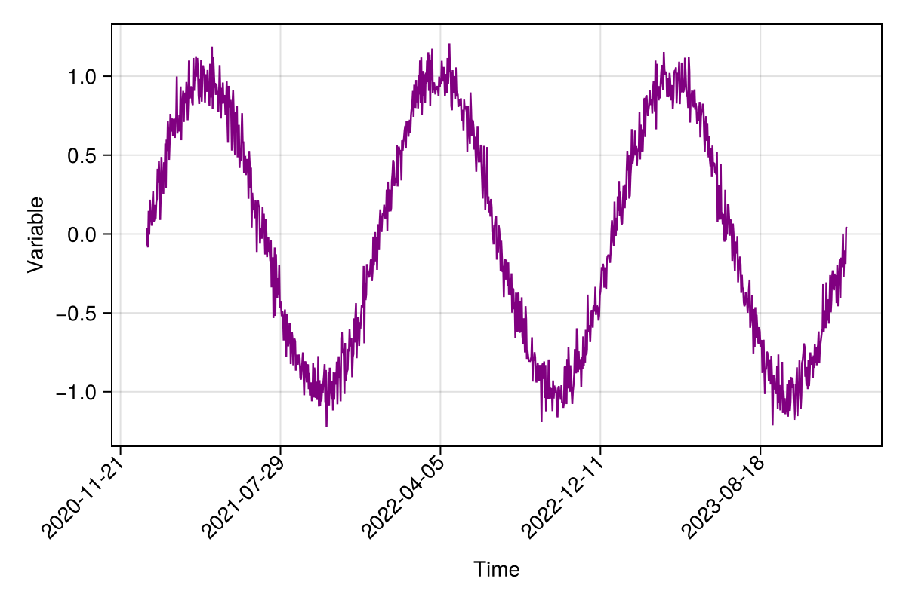
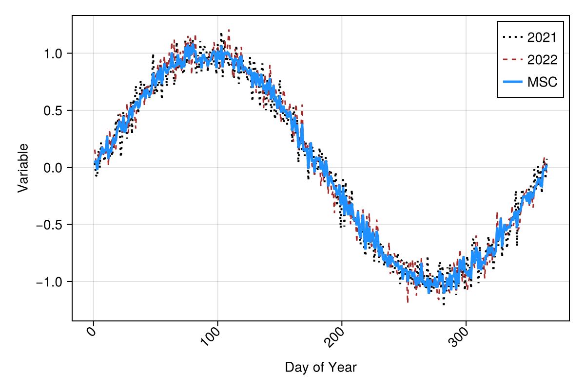

# Mean Seasonal Cycle for a single pixel {#Mean-Seasonal-Cycle-for-a-single-pixel}

```julia
using CairoMakie
CairoMakie.activate!()
using Dates
using Statistics
```


We define the data span. For simplicity, three non-leap years were selected.

```julia
t =  Date("2021-01-01"):Day(1):Date("2023-12-31")
NpY = 3
```


```
3
```


and create some seasonal dummy data

```julia
x = repeat(range(0, 2π, length=365), NpY)
var = @. sin(x) + 0.1 * randn()
```


```julia
fig, ax, obj = lines(t, var; color = :purple, linewidth=1.25,
    axis=(; xlabel="Time", ylabel="Variable"),
    figure = (; size = (600,400))
    )
ax.xticklabelrotation = π / 4
ax.xticklabelalign = (:right, :center)
fig
```

{width=600px height=400px}

### Define the cube {#Define-the-cube}

```julia
julia> using YAXArrays, DimensionalData

julia> using YAXArrays: YAXArrays as YAX

julia> axes = (YAX.Time(t),)
```

```ansi
(↓ Time Date("2021-01-01"):Dates.Day(1):Date("2023-12-31"))
```

```julia
julia> c = YAXArray(axes, var)
```

```ansi
┌ 1095-element YAXArray{Float64, 1} ┐
├───────────────────────────────────┴──────────────────────────────────── dims ┐
  ↓ Time Sampled{Date} Date("2021-01-01"):Dates.Day(1):Date("2023-12-31") ForwardOrdered Regular Points
├──────────────────────────────────────────────────────────────────── metadata ┤
  Dict{String, Any}()
├──────────────────────────────────────────────────────────── loaded in memory ┤
  data size: 8.55 KB
└──────────────────────────────────────────────────────────────────────────────┘
```


Let&#39;s calculate the mean seasonal cycle of our dummy variable &#39;var&#39;

```julia
function mean_seasonal_cycle(c; ndays = 365)
    ## filterig by month-day
    monthday = map(x->Dates.format(x, "u-d"), collect(c.Time))
    datesid = unique(monthday)
    ## number of years
    NpY = Int(size(monthday,1)/ndays)
    idx = Int.(zeros(ndays, NpY))
    ## get the day-month indices for data subsetting
    for i in 1:ndays
        idx[i,:] = Int.(findall(x-> x == datesid[i], monthday))
    end
    ## compute the mean seasonal cycle
    mscarray = map(x->var[x], idx)
    msc = mapslices(mean, mscarray, dims=2)
    return msc
end

msc = mean_seasonal_cycle(c);
```


```
365×1 Matrix{Float64}:
  0.03879945803136043
  0.06260577651410543
 -0.0219635849384688
  0.0776273050145437
  0.07734788438480804
  0.12186204478419795
  0.17931168226931812
  0.118931468021226
  0.16142509525832635
  0.14248833931152807
  ⋮
 -0.15270362595277617
 -0.10343132724059885
 -0.10354490162996693
 -0.15877650883324207
 -0.16451799038067652
 -0.022872265818509208
 -0.013690656055496556
 -0.01715112462831001
  0.02240115995635325
```


TODO: Apply the new groupby funtion from DD

### Plot results: mean seasonal cycle {#Plot-results:-mean-seasonal-cycle}

```julia
fig, ax, obj = lines(1:365, var[1:365]; label="2021", color=:black,
    linewidth=2.0, linestyle=:dot,
    axis = (;  xlabel="Day of Year", ylabel="Variable"),
    figure=(; size = (600,400))
    )
lines!(1:365, var[366:730], label="2022", color=:brown,
    linewidth=1.5, linestyle=:dash
    )
lines!(1:365, msc[:,1]; label="MSC", color=:dodgerblue, linewidth=2.5)
axislegend()
ax.xticklabelrotation = π / 4
ax.xticklabelalign = (:right, :center)
fig
current_figure()
```

{width=600px height=400px}
