# Plotting maps {#Plotting-maps}

As test data we use the CMIP6 Scenarios.

```julia
using Zarr, YAXArrays, Dates
using DimensionalData
using GLMakie, GeoMakie
using GLMakie.GeometryBasics

store ="gs://cmip6/CMIP6/ScenarioMIP/DKRZ/MPI-ESM1-2-HR/ssp585/r1i1p1f1/3hr/tas/gn/v20190710/"
```


```
"gs://cmip6/CMIP6/ScenarioMIP/DKRZ/MPI-ESM1-2-HR/ssp585/r1i1p1f1/3hr/tas/gn/v20190710/"
```


```julia
julia> g = open_dataset(zopen(store, consolidated=true))
```

```ansi
YAXArray Dataset
Shared Axes:
None
Variables: 
height

Variables with additional axes:
  Additional Axes: 
  (↓ lon  Sampled{Float64} 0.0:0.9375:359.0625 ForwardOrdered Regular Points,
  → lat  Sampled{Float64} [-89.28422753251364, -88.35700351866494, …, 88.35700351866494, 89.28422753251364] ForwardOrdered Irregular Points,
  ↗ time Sampled{DateTime} [2015-01-01T03:00:00, …, 2101-01-01T00:00:00] ForwardOrdered Irregular Points)
  Variables: 
  tas

Properties: Dict{String, Any}("initialization_index" => 1, "realm" => "atmos", "variable_id" => "tas", "external_variables" => "areacella", "branch_time_in_child" => 60265.0, "data_specs_version" => "01.00.30", "history" => "2019-07-21T06:26:13Z ; CMOR rewrote data to be consistent with CMIP6, CF-1.7 CMIP-6.2 and CF standards.", "forcing_index" => 1, "parent_variant_label" => "r1i1p1f1", "table_id" => "3hr"…)
```


```julia
julia> c = g["tas"];


```


Subset, first time step

```julia
julia> ct1_slice = c[time = Near(Date("2015-01-01"))];


```


use lookup to get axis values

```julia
lon_d = lookup(ct1_slice, :lon)
lat_d = lookup(ct1_slice, :lat)
data_d = ct1_slice.data[:,:];
```


## Heatmap plot {#Heatmap-plot}

```julia
GLMakie.activate!()

fig, ax, plt = heatmap(ct1_slice; colormap = :seaborn_icefire_gradient,
    axis = (; aspect=DataAspect()),
    figure = (; size = (1200,600), fontsize=24))
fig
```

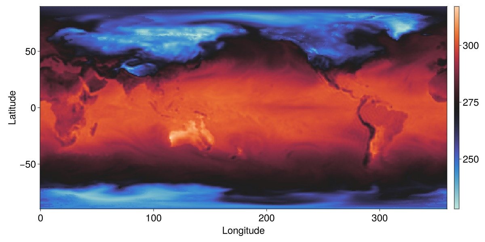

# Wintri Projection {#Wintri-Projection}

Some transformations

```julia
δlon = (lon_d[2] - lon_d[1])/2
nlon = lon_d .- 180 .+ δlon
ndata = circshift(data_d, (192,1))
```


and add Coastlines with `GeoMakie.coastlines()`, 

```julia
fig = Figure(;size=(1200,600))
ax = GeoAxis(fig[1,1])
surface!(ax, nlon, lat_d, ndata; colormap = :seaborn_icefire_gradient, shading=false)
cl=lines!(ax, GeoMakie.coastlines(), color = :white, linewidth=0.85)
translate!(cl, 0, 0, 1000)
fig
```

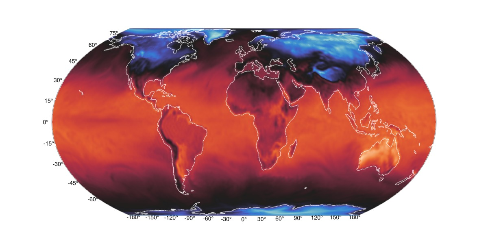

## Moll projection {#Moll-projection}

```julia
fig = Figure(; size=(1200,600))
ax = GeoAxis(fig[1,1]; dest = "+proj=moll")
surface!(ax, nlon, lat_d, ndata; colormap = :seaborn_icefire_gradient, shading=false)
cl=lines!(ax, GeoMakie.coastlines(), color = :white, linewidth=0.85)
translate!(cl, 0, 0, 1000)
fig
```

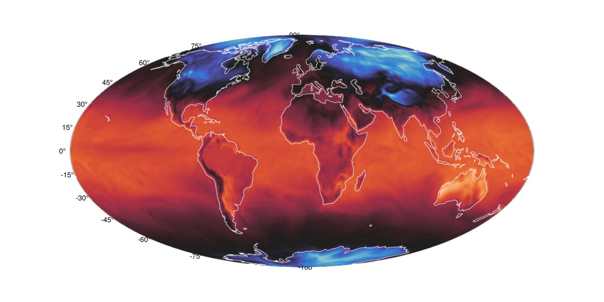

## 3D sphere plot {#3D-sphere-plot}

```julia
using GLMakie
using GLMakie.GeometryBasics
GLMakie.activate!()

ds = replace(ndata, missing =>NaN)
sphere = uv_normal_mesh(Tesselation(Sphere(Point3f(0), 1), 128))

fig = Figure(backgroundcolor=:grey25, size=(500,500))
ax = LScene(fig[1,1], show_axis=false)
mesh!(ax, sphere; color = ds'[end:-1:1,:], shading=false,
    colormap = :seaborn_icefire_gradient)
zoom!(ax.scene, cameracontrols(ax.scene), 0.5)
rotate!(ax.scene, 2.5)
fig
```

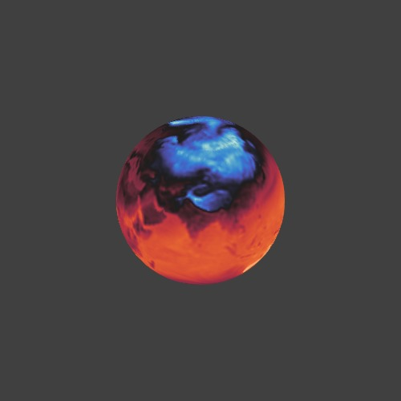

## AlgebraOfGraphics.jl {#AlgebraOfGraphics.jl}

::: info

From [DimensionalData docs](https://rafaqz.github.io/DimensionalData.jl/stable/plots#algebraofgraphics-jl) :

**AlgebraOfGraphics.jl** is a high-level plotting library built on top of `Makie.jl` that provides a declarative algebra for creating complex visualizations, similar to **ggplot2**&#39;s &quot;grammar of graphics&quot; in R. It allows you to construct plots using algebraic operations like `*` and `+`, making it easy to create sophisticated graphics with minimal code.

:::

```julia
using YAXArrays, Zarr, Dates
using GLMakie
using AlgebraOfGraphics
using GLMakie.GeometryBasics
GLMakie.activate!()
```


let&#39;s continue using the cmip6 dataset

```julia
store ="gs://cmip6/CMIP6/ScenarioMIP/DKRZ/MPI-ESM1-2-HR/ssp585/r1i1p1f1/3hr/tas/gn/v20190710/"
g = open_dataset(zopen(store, consolidated=true))
c = g["tas"];
```


and let&#39;s focus on the first time step:

```julia
dim_data = readcubedata(c[time=1]); # read into memory first!
```


and now plot

```julia
data(dim_data) * mapping(:lon, :lat; color=:value) * visual(Scatter) |> draw
```

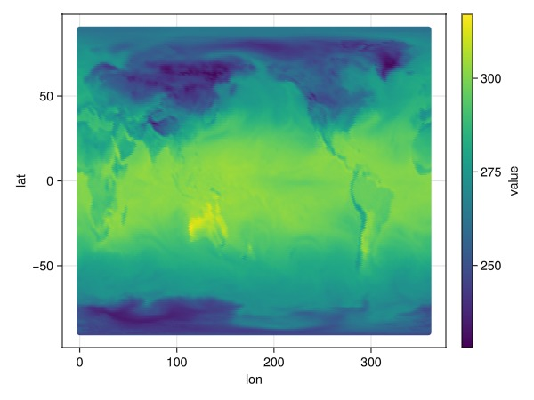

::: warning

Note that we are using a `Scatter` type per point and not the `Heatmap` one. There are workarounds for this, albeit cumbersome, so for now, let&#39;s keep this simpler syntax in mind along with the current approach being used.

:::

set other attributes

```julia
plt = data(dim_data) * mapping(:lon, :lat; color=:value)
draw(plt * visual(Scatter, marker=:rect), scales(Color = (; colormap = :plasma));
    axis = (width = 600, height = 400, limits=(0, 360, -90, 90)))
```

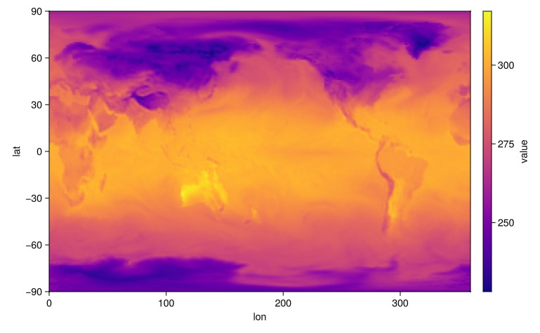

### Faceting {#Faceting}

For this let&#39;s consider more time steps from our dataset:

```julia
using Dates
dim_time = c[time=DateTime("2015-01-01") .. DateTime("2015-01-01T21:00:00")] # subset 7 t steps
```


```
┌ 384×192×7 YAXArray{Float32, 3} ┐
├────────────────────────────────┴─────────────────────────────────────── dims ┐
  ↓ lon  Sampled{Float64} 0.0:0.9375:359.0625 ForwardOrdered Regular Points,
  → lat  Sampled{Float64} [-89.28422753251364, -88.35700351866494, …, 88.35700351866494, 89.28422753251364] ForwardOrdered Irregular Points,
  ↗ time Sampled{DateTime} [2015-01-01T03:00:00, …, 2015-01-01T21:00:00] ForwardOrdered Irregular Points
├──────────────────────────────────────────────────────────────────── metadata ┤
  Dict{String, Any} with 10 entries:
  "units"         => "K"
  "history"       => "2019-07-21T06:26:13Z altered by CMOR: Treated scalar dime…
  "name"          => "tas"
  "cell_methods"  => "area: mean time: point"
  "cell_measures" => "area: areacella"
  "long_name"     => "Near-Surface Air Temperature"
  "coordinates"   => "height"
  "standard_name" => "air_temperature"
  "_FillValue"    => 1.0f20
  "comment"       => "near-surface (usually, 2 meter) air temperature"
├─────────────────────────────────────────────────────────────── loaded lazily ┤
  data size: 1.97 MB
└──────────────────────────────────────────────────────────────────────────────┘
```


```julia
dim_time = readcubedata(dim_time); # read into memory first!
```


```julia
plt = data(dim_time) * mapping(:lon, :lat; color = :value, layout = :time => nonnumeric)
draw(plt * visual(Scatter, marker=:rect))
```

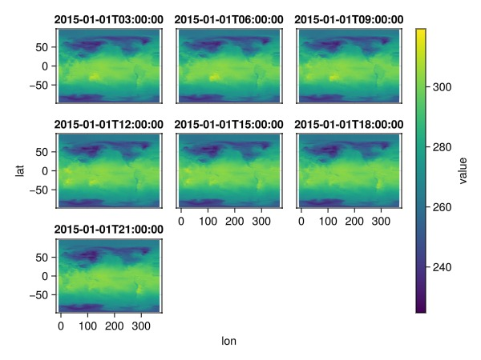

again, let&#39;s add some additional attributes

```julia
plt = data(dim_time) * mapping(:lon, :lat; color = :value, layout = :time => nonnumeric)
draw(plt * visual(Scatter, marker=:rect), scales(Color = (; colormap = :magma));
    axis = (; limits=(0, 360, -90, 90)),
    figure=(; size=(900,600)))
```

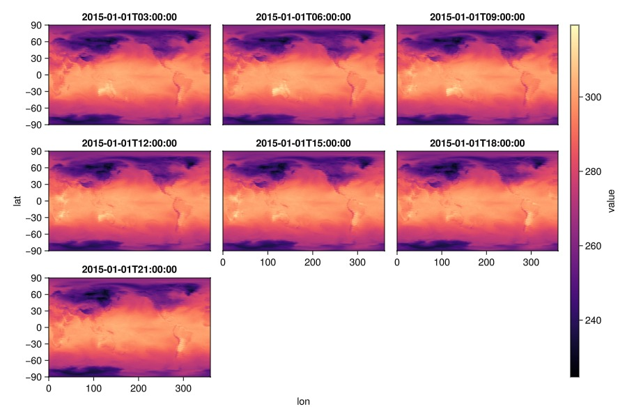

most [Makie plot functions](https://docs.makie.org/stable/reference/plots/overview) should work. See `lines` for example

```julia
plt = data(dim_data[lon=50..100]) * mapping(:lat, :value => "tas"; color=:value => "tas")
draw(plt * visual(Lines); figure=(; size=(650,400)))
```

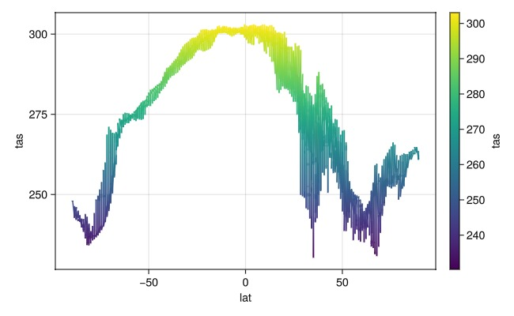

or faceting them

```julia
plt = data(dim_data[lon=50..59]) * mapping(:lat, :value => "tas"; color=:value => "tas",
    layout = :lon => nonnumeric)
draw(plt * visual(Lines); figure=(; size=(650,400)))
```

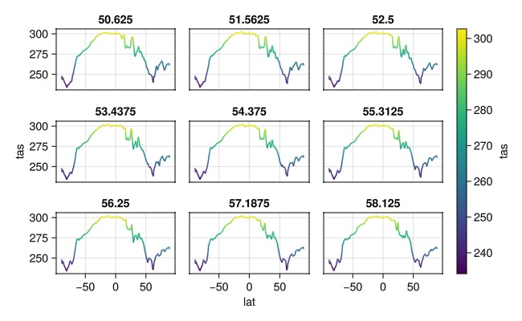

### Time series {#Time-series}

For this, let&#39;s load a little bit more of time steps

```julia
dim_series = c[time=DateTime("2015-01-01") .. DateTime("2015-01-04"), lon = 150 .. 157, lat = 0..1] |> readcubedata
```


```
┌ 8×1×24 YAXArray{Float32, 3} ┐
├─────────────────────────────┴────────────────────────────────────────── dims ┐
  ↓ lon  Sampled{Float64} 150.0:0.9375:156.5625 ForwardOrdered Regular Points,
  → lat  Sampled{Float64} [0.4675308904227747] ForwardOrdered Irregular Points,
  ↗ time Sampled{DateTime} [2015-01-01T03:00:00, …, 2015-01-04T00:00:00] ForwardOrdered Irregular Points
├──────────────────────────────────────────────────────────────────── metadata ┤
  Dict{String, Any} with 10 entries:
  "units"         => "K"
  "history"       => "2019-07-21T06:26:13Z altered by CMOR: Treated scalar dime…
  "name"          => "tas"
  "cell_methods"  => "area: mean time: point"
  "cell_measures" => "area: areacella"
  "long_name"     => "Near-Surface Air Temperature"
  "coordinates"   => "height"
  "standard_name" => "air_temperature"
  "_FillValue"    => 1.0f20
  "comment"       => "near-surface (usually, 2 meter) air temperature"
├──────────────────────────────────────────────────────────── loaded in memory ┤
  data size: 768.0 bytes
└──────────────────────────────────────────────────────────────────────────────┘
```


and plot

```julia
plt = data(dim_series) * mapping(:time, :value => "tas"; color=:lon => nonnumeric)
draw(plt * visual(ScatterLines), scales(Color = (; palette = :tableau_colorblind));
    figure=(; size=(800,400)))
```

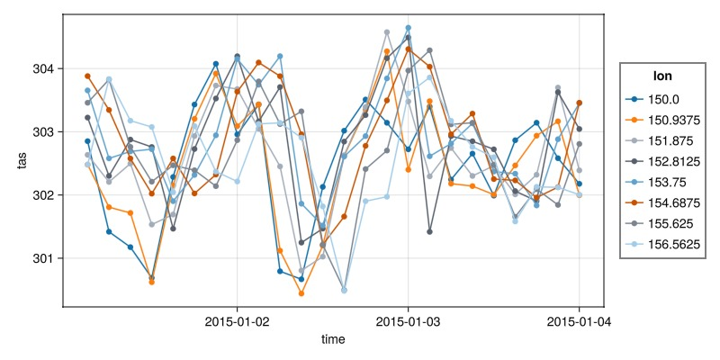

### Analysis {#Analysis}

Basic statistical [analysis](https://aog.makie.org/stable/generated/analyses/) can also be done, for example:

```julia
specs = data(dim_data[lat=50..55]) * mapping(:lon, :value => "tas"; color=:lat => nonnumeric)
specs *= (smooth() + visual(Scatter))
draw(specs;  figure=(; size=(700,400)))
```

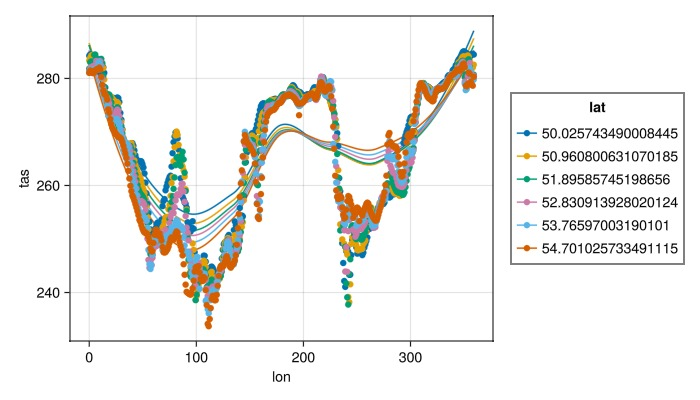

For more, visit [AlgebraOfGraphics.jl](https://aog.makie.org/stable/).
